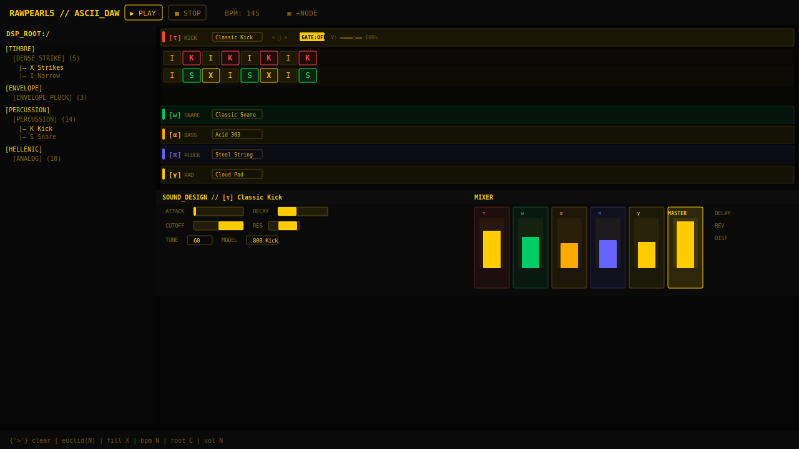

# ⚡ RAWPEARL5

> ASCII-based DAW — character grid sequencer with native DSP synthesis, 9 Hellenic engine types, and a live-compiled math sandbox.



---

## Overview

RAWPEARL5 is a **character-grid sequencer** where each cell on the grid holds a single ASCII symbol that maps to a DSP parameter set. Every symbol carries three domains (T/M/B — Spatial, Timbre, Envelope) that merge at each step. The result is a live, note-by-note sound design environment with zero timeline zooming or piano rolls.

## Quick Start

```bash
cd WebUI
npm install
npm run dev
```

Then open `http://localhost:5173` in a browser. Build the C++ exe:

```powershell
.\build_ui.ps1
```

## Core Concepts

### Grid
32-step pattern grid with 3 layers per channel (Top/Mid/Bottom). Each layer contributes its domain at the step: T (routing/FX), M (source/timbre), B (envelope/texture).

### Hellenic Engines
9 native synthesizer types, each with multiple preset models:

| Symbol | Engine | Models |
|--------|--------|--------|
| α | Analog Subtractive (Saw+Square) | 10 (Saw Lead, Acid 303, Square Bass, Pluck...) |
| δ | Digital Wavetable (Morph) | 8 (Digital Pad, Morph Bell, Sweep, Glass...) |
| φ | FM Synthesis (2-Op) | 8 (FM Bass, FM Bell, FM Brass, FM E.Piano...) |
| Σ | Additive Spectral | 8 (Soft Pad, Bright Keys, Brass Section, Organ...) |
| γ | Granular Engine | 8 (Cloud Pad, Shimmer, Scatter, Granular Bass...) |
| ω | Chaotic Noise Resonator | 8 (Wind, Crackle, Rumble, Breaths, Static...) |
| π | Physical Modeling (KS) | 8 (Nylon Guitar, Steel String, Harp, Koto...) |
| τ | Transistor Percussion | 13 (Classic Kick, 808, 909, Deep Sub, Tom...) |
| w | Noise Percussion | 22 (Snare, Hats, Clap, Conga, Rimshot, Crash...) |

### Math Sandbox
Live-compiled DSP equations. Write `sin(2 * pi * f * t)` or FM patches — the sandbox auto-repairs syntax and renders directly to audio.

### TMB 3-Layer Notation
Every ASCII symbol on the grid has three domain definitions:
- **T (Top)** — delay, reverb, ratchet, pan, probability
- **M (Mid)** — oscillator, velocity, noise layers, percussion engine
- **B (Bottom)** — attack/decay/release mod, granular density, LFO shapes

---

## Features

- **Character DSP Dictionary** — 60+ symbols each with unique T/M/B parameter sets
- **Per-step parameter overrides** — decay, attack, cutoff, resonance, gate, glitch per cell
- **Affinity system** — root note, scale, octave per channel
- **Sidechain** — per-channel compression/frequency ducking
- **Master FX** — delay, reverb, distortion, limiter
- **Mixer** — per-channel EQ, compression, sends, solo
- **Song Arranger** — pattern chain sequencing
- **μ-tuning** — microtonal per-step note offsets
- **Density engine** — weighted probability fill patterns
- **Live recording** — real-time step input
- **Undo/Redo** — full action history

## Tech Stack

- **Frontend:** React 19 + Vite + Tailwind CSS
- **Audio:** Web Audio API (native oscillators, noise buffers, biquad filters, convolution)
- **Desktop:** JUCE 8 C++ wrapper (Chromium Embedded)
- **DSP Sandbox:** Live `new Function()` compilation with Proxy safety scope

## Controls

| Key | Action |
|-----|--------|
| Click | Focus + paste brush |
| Type | Paste char into cell |
| Backspace | Erase cell |
| Escape | Unfocus |
| Right-click | Radial char browser + context |

## License

MIT © Orionx3000
